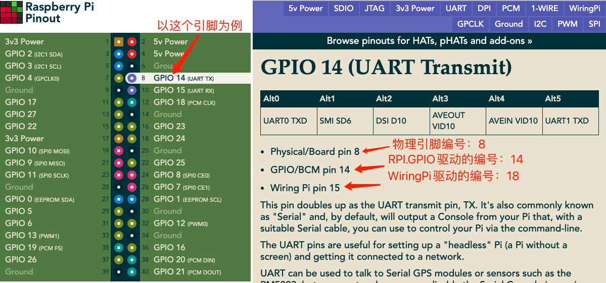

# 2.3 添加散热风扇根据温度启停
网上找到的教程大部分在基于树莓派的系统进行的，没有找到基于LibreELEC（Kodi）的，最后在境外的网站的找到类似需求的相关解决方案，并整理一下；

## 环境准备
* 安装Raspberry Pi Tools插件；
> 因为LibreELEC 系统是Kodi的最小运行环境，并未内置RPI.GPIO库，没办法直接执行命令操作GPIO，而我们要控制风扇的启停，则需要操作GPIO。
> 而上述这个插件就是安装我们需要的GPIO库的，安装完之后，就可以操作GPIO了；

## 实际操作
### 硬件

### 软件
1. [控制风扇的脚本](fans.py),将脚本保存到/storage/bins目录下（如果没有，则新建，当然也可以是其他路径，只要开机任务写对就行）;
2. 将脚本加入到系统自启动任务中；
	* 创建/storage/.config/autostart.sh文件，并写入以下内容
	
	```
	#!/bin/sh
(
    nohup python /storage/bins/fans.py &
) &
	```
	* 给这个脚本赋执行权限：chmod +x /storage/.config/autostart.sh


### 关键脚本解释
由于将注释添加到脚本里会影响代码美观，就在这里解释代码吧：  
下面这一行很关键，是将gpio驱动库引入的，如果没有这一行，则无法使用GPIO，能用这一行代码的前提，是已经安装了Raspberry Pi Tools插件；

```sys.path.append('/storage/.kodi/addons/virtual.rpi-tools/lib')```

下面这一行定义信号输出的GPIO引脚。

```
channel = 18
```

<font color=red>`注意:`</font>，相同的引脚在不同驱动下使用引脚的编号是不一样的。[点击这里查看引脚定义](https://pinout.xyz/)，可以看每个引脚的具体定义及各个驱动下的引脚编号；  
我这里有一个在上述页面识别编号的例子：


下面这一行是读取CPU温度的,CPU的温度会写入这个系统文件中。python的with open命令可以自动处理close操作，所以如果你喜欢其他写法，请注意读完后，别忘了close;

```
with open("/sys/class/thermal/thermal_zone0/temp", 'r') as f
```

关于/storage/.config/autostart.sh文件  
这个文件是系统开机自动执行的文件，如果没有，新建一个就行了。